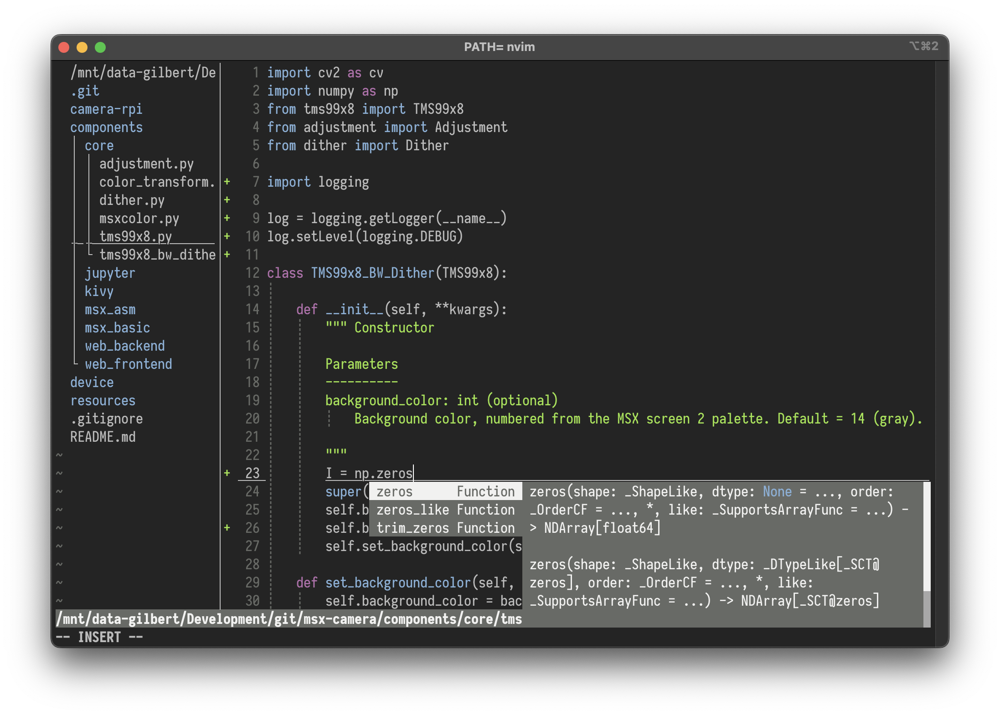
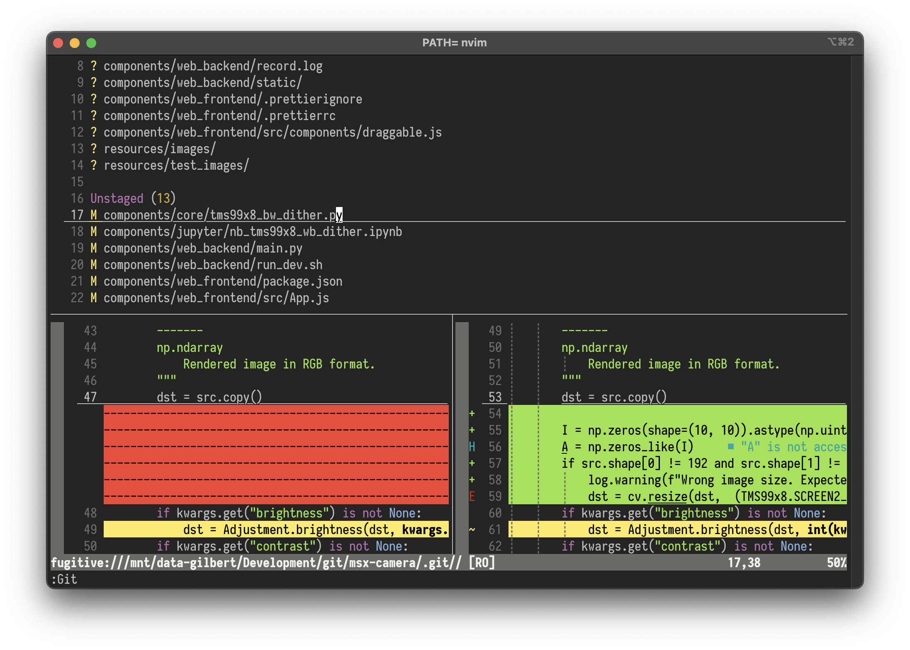

# BLiTzBLiT terminal color schemes for VIM
_Gilbert François_

This colorscheme is made with 16 colors only, matching your terminal colors perfectly. It looks beautiful when using e.g. iTerm, Blink or Ubuntu terminal with a color scheme to your taste.

The highlight colors are inspired by the Atom dark theme.

